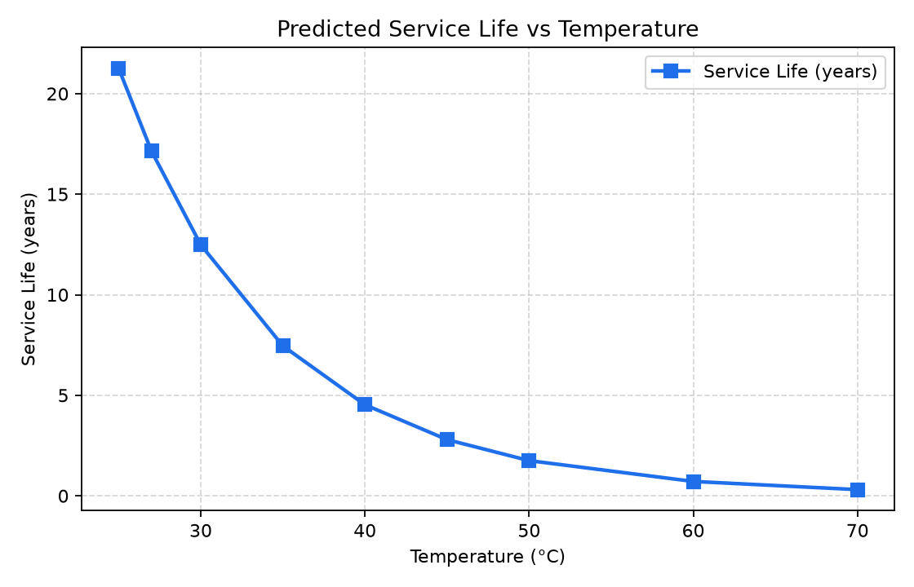
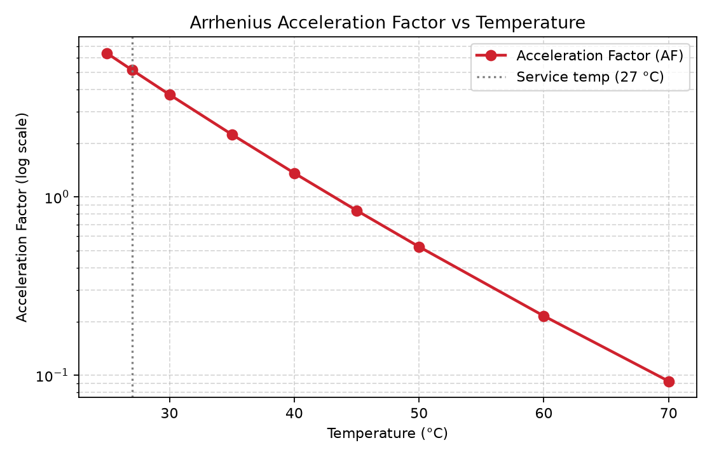
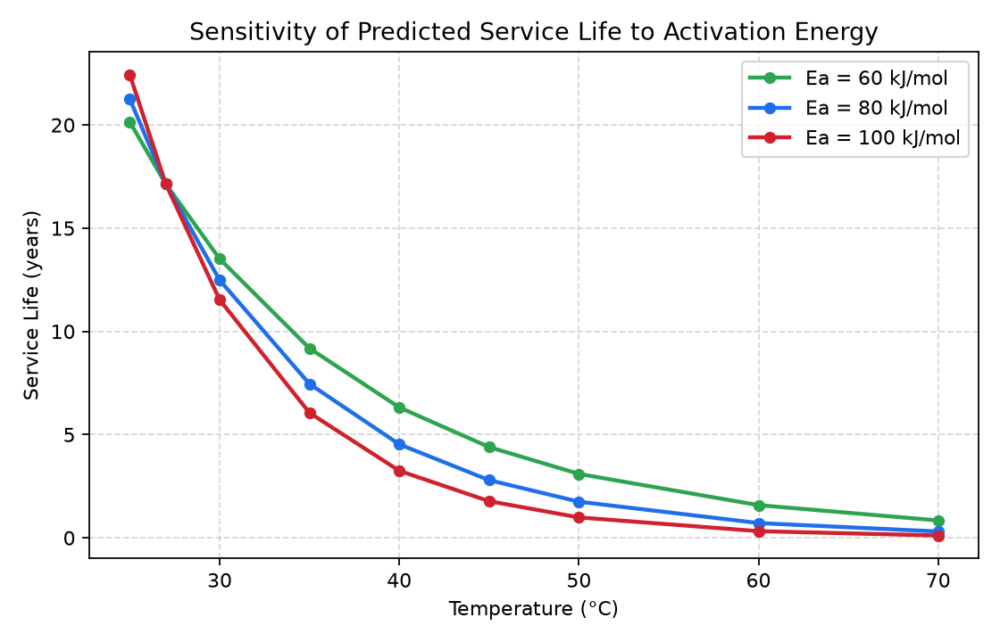
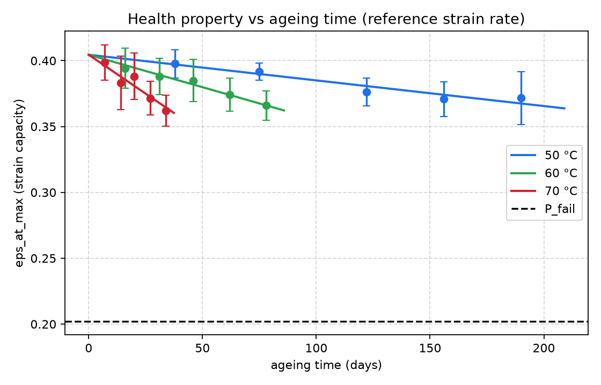
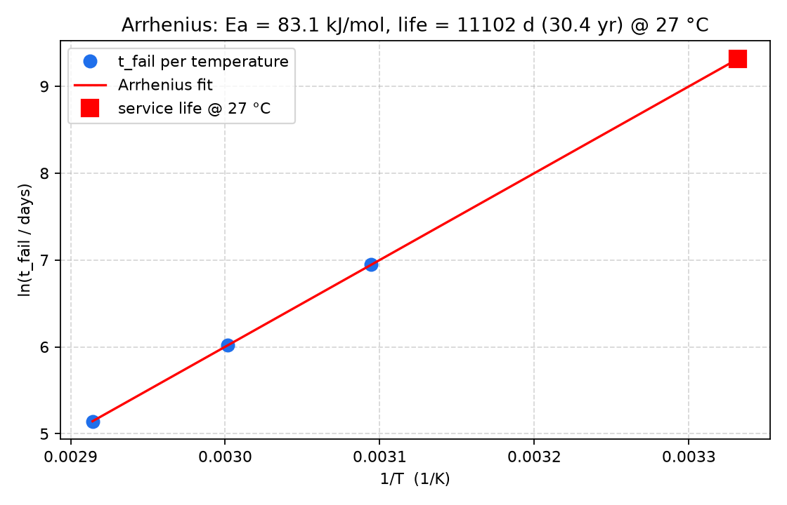
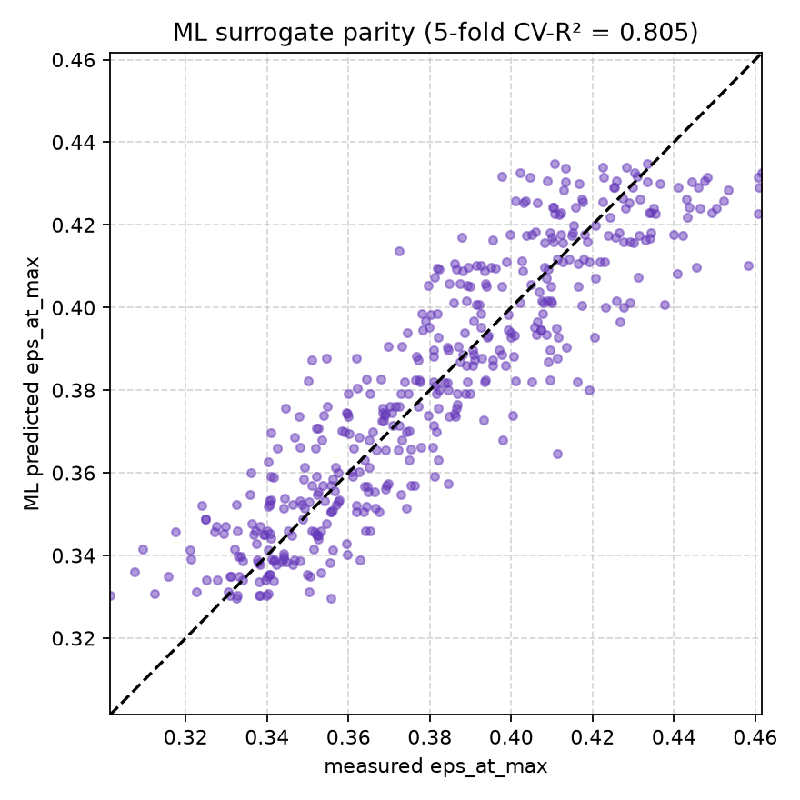

# Service-Life Prediction of Solid Rocket Propellants

### Aging, Cumulative-Damage and Accelerated-Testing Models with a MATLAB Arrhenius Implementation

**Technical Report — Structural Integrity & Service-Life Assessment of Energetic Materials**

| | |
|---|---|
| Prepared by | ______________________ |
| Organisation | GTAG |
| Date | ______________________ |

> This Markdown file mirrors the formatted Word report
> (`Service_Life_Prediction_of_Solid_Propellants.docx`). The `.docx` is the
> primary, editable deliverable; this file is provided for quick viewing on
> GitHub. Both are regenerated from the scripts in `code/`.

---

## Abstract

Solid rocket propellants are visco-elastic, highly filled polymeric composites
whose mechanical integrity slowly degrades during storage through coupled
chemical and physical aging. Predicting the remaining service life of a
propellant grain is therefore central to munition safety, readiness and
life-extension decisions. This report reviews the principal models used for
solid-propellant aging and service-life prediction — cumulative-damage failure
integrals, time–temperature superposition, viscoelastic finite-element
analysis, chemical-aging kinetics, handbook/nomograph design methods and
non-destructive-testing indicators — and consolidates the governing equations
behind them. A practical accelerated-aging model is then implemented in MATLAB:
an Arrhenius temperature-acceleration law coupled with a power-law
property-degradation rule estimates the time for a normalised mechanical
property to fall to a failure threshold over a range of storage temperatures.
The model predicts a strong, non-linear reduction in service life with
temperature — from roughly 21 years at 25 °C to under 4 months at 70 °C —
consistent with the shelf-life ranges reported in the literature. A second,
more complete data-driven pipeline is also presented: it reads
accelerated-ageing tensile tests, extracts mechanical properties, trains a
cross-validated machine-learning surrogate, fits global first-order Arrhenius
kinetics and predicts service life (recovering an activation energy of about
83 kJ/mol and a service life of roughly 30 years for the demonstration
dataset). Both codes, their governing formulae and reproducible results are
presented together with a practical decision tree for service-life assessment.

---

## 1. Introduction

Composite solid propellants are the energy source of the majority of tactical
and strategic rocket motors. Mechanically they behave as a highly filled
visco-elastic rubber: an elastomeric binder (most commonly hydroxyl-terminated
polybutadiene, HTPB) holds a high volume fraction of oxidiser (ammonium
perchlorate, AP) and metallic fuel (aluminium) particles. The grain is bonded
to the motor case and must survive ignition pressurisation, thermal cycling,
transport vibration and long-term storage without cracking, debonding or losing
its designed burning surface.

Because a motor may be stored for one to two decades before use, the slow
evolution of the propellant's properties — collectively called *aging* —
governs its useful life. Aging is driven by two broad mechanisms acting
together:

- **Chemical aging** — continued cross-linking, chain scission and oxidative
  cure of the binder, together with migration of plasticiser and bonding
  agents, which usually stiffen and embrittle the material; and
- **Physical / mechanical aging** — the accumulation of micro-damage (dewetting
  of filler particles, micro-void growth, interface debonding) under thermal and
  mechanical loading, which softens and weakens the material.

Both mechanisms are strongly temperature-accelerated, so elevated-temperature
testing is used to compress decades of natural aging into a few weeks or months
in the laboratory. The central engineering question is then how to translate
those accelerated measurements into a defensible estimate of service life at the
real storage temperature.

### 1.1 Composition and microstructure
A composite solid propellant is engineered at the level of its microstructure. A
representative AP/HTPB formulation contains roughly **85–90 % by mass of solid
fillers** held together by only **10–15 % of polymeric binder**:

- **Binder** — a cross-linked elastomer (HTPB cured with a di-/tri-isocyanate)
  that provides the continuous, load-bearing matrix and gives the grain its
  compliance and strain capability.
- **Oxidiser** — ammonium perchlorate (AP), usually a bimodal coarse/fine blend
  to maximise solids loading; supplies the combustion oxygen and dominates the
  volume fraction.
- **Metallic fuel** — aluminium powder, which raises flame temperature and
  specific impulse and suppresses combustion instability.
- **Additives** — bonding agents (strengthen the binder–filler interface),
  plasticisers (lower the glass transition, improve low-temperature strain),
  cure catalysts, antioxidants and burn-rate modifiers.

Mechanically the cured grain is a particulate composite: stiff inclusions in a
soft matrix bonded across an interface. Most aging phenomena, and most failures,
originate at that binder–filler interface or in the binder network itself.

### 1.2 Structural failure modes
"Failure" of a grain is a set of distinct mechanical limit states:

- **Cracking** — surface/bore cracking under thermal-shrinkage and
  pressurisation strains, exposing extra burning area and over-pressurising the
  chamber.
- **Debonding** — separation of grain from case/insulation, a leading cause of
  catastrophic motor failure.
- **Dewetting** — microscopic binder–filler separation that nucleates voids and
  reduces modulus and strength (an early crack precursor).
- **Embrittlement** — loss of strain capability as the binder hardens, so
  once-tolerable strains now exceed the rupture limit, especially when cold.

Because all of these are governed by mechanical properties that drift with age,
tracking a representative property over time is a rational basis for
service-life prediction — exactly the approach used here.

### 1.3 Aging mechanisms in detail
**Chemically**, the isocyanate-cured HTPB network keeps reacting after
manufacture: post-cure and oxidative cross-linking tighten the network (raising
modulus/hardness, lowering strain capability), while competing chain scission
and hydrolysis soften it, and plasticiser/bonding-agent migration changes local
stiffness. Layton's [4] observation that properties drift roughly with the
**logarithm of aging time** is a signature of these diffusion- and
reaction-limited processes.

**Physically**, thermal cycling and sustained loads accumulate irreversible
micro-damage (dewetting, micro-void growth, debonding) that softens and weakens
the material. The two families *compete*: a propellant may first stiffen
(hardening dominant) then soften (damage/scission dominant), producing the
non-monotonic property–time curves Adel and Liang [10] model explicitly. The
rates of nearly all of these processes rise approximately exponentially with
temperature — the physical justification for the Arrhenius treatment (§4.1).

### 1.4 Why service-life prediction matters
Service-life prediction is the technical backbone of stockpile surveillance and
service-life-extension programmes (SLEP). A defensible remaining-life estimate
determines when a motor must be inspected, re-qualified, refurbished or
disposed of, trading safety against the high cost of prematurely scrapping
serviceable munitions. Under-prediction wastes assets and readiness;
over-prediction risks catastrophic failure in storage, transport or flight.

---

## 2. Problem Statement

Service-life prediction must answer a deceptively simple question: *for how long
will the grain remain structurally sound at its storage temperature before a
critical mechanical property falls below an acceptable limit?* This is hard
because:

- **Time-scale mismatch** — natural aging is far slower than any test programme,
  so results must be extrapolated from accelerated tests using a
  temperature-acceleration model whose activation energy must itself be
  estimated.
- **Rate and temperature dependence** — the visco-elastic binder depends on
  rate, temperature and load history; a single static property is not enough.
- **Competing mechanisms** — hardening and softening can dominate at different
  times/temperatures, so the property–time curve is not always monotonic.
- **Parameter uncertainty** — parameters are regression-fitted from scattered
  data; biased fitting gives over-optimistic life estimates.

### 2.1 Formal statement
Let `P(t, T)` be a normalised mechanical property that evolves with aging time
`t` at absolute temperature `T`, and `P_crit` the smallest acceptable value
before a limit state of §1.2 is reached. The service life `t_L` at storage
temperature `T_s` is defined implicitly by

$$P(t_L, T_s) = P_\text{crit} \tag{I}$$

Because tests run at elevated `T_test > T_s`, the property is measured as
`P(t_test, T_test)` and a temperature-acceleration model is required to map that
observation back to the slow process at `T_s`. Service-life prediction is
therefore a coupled problem: a **degradation law** (how `P` decays with time)
plus an **acceleration law** (how that decay speeds up with temperature). This
report adopts a power-law degradation rule (§4.2) and an Arrhenius acceleration
law (§4.1).

### 2.2 Choice of failure criterion
`P_crit` must reflect the dominant limit state — e.g. a maximum allowable loss
of strain capability (cracking), a minimum bond strength (debonding), or a
maximum modulus increase (embrittlement). Here a single normalised property with
`P_crit = 0.3` (failure at 30 % of initial value) is used as a transparent,
generic surrogate; the framework is unchanged if a different property/threshold
is substituted.

---

## 3. Literature Review

A broad body of work was surveyed for this study. It groups into six
complementary families of models, around which the discussion below is
organised. The numbered references cited are *representative* of each family —
an illustrative subset of the literature consulted, not an exhaustive list.

### 3.1 Cumulative-damage failure models
Cumulative-damage approaches treat failure as the gradual accumulation of a
scalar damage measure `D` until it reaches a critical value (`D = 1`) — apt for
propellants, which see a long, variable load history.

Biggs, Nestor et al. **[1]** (US 6,301,970) patent a stress-based failure
integral: they accumulate damage as a time integral of a stress-/strain-
dependent rate, extract the rate-law parameters by regression, integrate
numerically over the load history, and wrap the calculation in a **Monte-Carlo**
loop so scatter propagates into a *probability* of failure. Kunz **[8]** tackles
the weakest link — the parameters — refining Laheru-type linear cumulative-
damage (LCD) parameter determination and showing that ordinary regression can be
**biased**, directly relevant to the regression-fitted exponent `n` used here
(see §6.3).

### 3.2 Time–temperature superposition and viscoelastic characterisation
The key organising idea for visco-elastic materials is **time–temperature
superposition (TTS)**: raising temperature is, to first order, equivalent to
extending observation time, so data at many temperatures shift onto one
**master curve** spanning many decades of effective time. Villar and Rezende
**[2]** apply this to thermally aged composite propellant using WLF shift
factors, showing aging shifts the curve modestly at short times but
significantly at long times — exactly the service-life regime. Tapia-Romero,
Dehonor-Gómez and Lugo-Uribe **[9]** give a robust route from frequency-domain
DMA data to a time-domain **Prony series** (Eq. 6), the constitutive input the
FE analyses below require.

### 3.3 Structural / finite-element assessment
Material-level curves become a service-life statement only when combined with
the actual grain stresses/strains. Yıldırım and Özüpek **[3]** perform a
non-linear visco-elastic **finite-element** assessment, modelling the grain with
a time-/temperature-dependent law and applying realistic combined load cases
(cure shrinkage, thermal cool-down/soak, ignition pressurisation). They identify
inner-bore **hoop strain** and **case-bond stress** as governing failure
indicators and quantify how aging erodes the margin between demand and
(shrinking) capability — the bridge between property-level models and a
structural verdict.

### 3.4 Chemical / kinetic aging studies
Layton **[4]** explains *why* properties drift: tracking gel content (cross-link
density) against mechanical change, he finds drift scaling with the **logarithm
of aging time** and a strong influence of bonding-agent chemistry. This both
justifies the **Arrhenius** temperature dependence (thermally activated
reactions) and supports the power-law/log degradation form of §4.2 on physical,
not merely empirical, grounds.

### 3.5 Handbook and nomograph design methods
Consolidated handbook/nomograph methods compress test experience into rapid hand
calculations. Waterman and Corley **[5]** give a handbook treatment of aging,
thermal cycling and strain-based failure estimation for tactical grains. The
Aerojet **NWC TM 3365** nomograph **[6]** encodes relationships among geometric
and material variables (web, bore, modulus, thermal-expansion mismatch,
temperature swing) into a straight-edge thermal-cycling failure estimate. These
trade fidelity for speed/transparency — the same "rapid-estimate" tradition as
this report's compact model.

### 3.6 Non-destructive and full-life prediction methods
Husband and Roberto **[7]** (US 5,038,295) use **dynamic mechanical properties**
as a non-destructive aging-rate indicator, so the same asset can be re-measured
over its life and its remaining life updated — something purely predictive
models cannot do alone. Adel and Liang **[10]** present a full AP/Al/HTPB
service-life prediction that explicitly models the competition between hardening
and softening (a non-monotonic property–time curve) and report a shelf-life of
**≈ 13 years** — the most direct published benchmark for the results in §6.

---

## 4. Governing Models and Equations

The implemented code (§5) uses Eqs. (1)–(4); Eqs. (5)–(7) describe the
complementary viscoelastic and cumulative-damage frameworks reviewed above.

### 4.1 Arrhenius temperature-acceleration model
Aging is controlled by thermally activated reactions, so the aging rate constant
`k` at absolute temperature `T` follows the Arrhenius law:

$$k(T) = A_0 \, \exp\!\left(-\frac{E_a}{R\,T}\right) \tag{1}$$

where *E*ₐ is the activation energy (the barrier height and the single most
influential parameter), *R* = 8.314 J·mol⁻¹·K⁻¹, and *A*₀ a pre-exponential
factor. For propellant binders *E*ₐ is typically **60–100 kJ/mol** (80 kJ/mol
used here). *A*₀ cancels in the ratio of rates at the test and service
temperatures — the **acceleration factor**:

$$\mathrm{AF} = \dfrac{k(T_\text{test})}{k(T_\text{service})} = \exp\!\left[\dfrac{E_a}{R}\left(\dfrac{1}{T_\text{service}} - \dfrac{1}{T_\text{test}}\right)\right] \tag{2}$$

AF > 1 means a short hot test reproduces a long period of cool storage — the
basis of accelerated aging. Because AF depends on 1/T inside an exponential it
is **very sensitive** (the "every 10 °C halves the life" rule of thumb). The
main assumptions are a single dominant reaction (one *E*ₐ) over the whole range
and an unchanged failure mechanism — which is why test temperatures are kept as
low as the test duration allows.

> Equation (2) is the conventional form (AF > 1 for `T_test > T_service`). The
> implemented script computes a related temperature-scaling quantity that uses
> the reciprocal difference with the **opposite sign** and folds in the
> power-law pre-factor `A`; see §5.3. The physical conclusion is unchanged:
> predicted life falls as temperature rises.

### 4.2 Power-law property-degradation (cumulative damage)
A second law describes how the property decays as aging accumulates. Motivated by
the observed logarithmic-in-time drift (§3.4), the normalised property `E` is
modelled as a power law:

$$E(t) = A \, t^{\,n} \tag{3}$$

with degradation exponent `n` (negative for a decaying property). `A` is anchored
to the measured test point so the curve passes through `(E_test, t_test)`:

$$A = \frac{E_\text{test}}{(t_\text{test})^{\,n}} \tag{3a}$$

Setting `E(t_f) = E_crit` and solving gives the failure time:

$$t_f = \left(\frac{E_\text{crit}}{A}\right)^{1/n} \tag{4}$$

Multiplying `t_f` by the temperature-scaling factor (§4.1) gives the equivalent
service life, divided by 365.25 for years. Assumptions: a single power law over
the whole life and a monotonic curve — the latter exactly what Adel and Liang
[10] relax.

### 4.3 Time–temperature superposition (WLF)
A visco-elastic propellant has no single stiffness — its response depends on how
fast and how long it is loaded. **Time–temperature superposition (TTS)** says
raising temperature is equivalent to stretching the time scale, so a property
measured at `T` over an accessible time window maps onto an equivalent response
at a reference temperature `T_ref` but at a much longer effective time. The
mapping is a horizontal shift by a factor `a_T` along the log-time axis;
stacking the shifted segments builds one **master curve** spanning 10+ decades of
effective time from only hours of testing per temperature. For amorphous
polymers above their glass transition, the shift factor follows the empirical
**Williams–Landel–Ferry (WLF)** equation [2]:

$$\log_{10}(a_T) = -\dfrac{C_1\,(T - T_\text{ref})}{C_2 + (T - T_\text{ref})} \tag{5}$$

`C₁`, `C₂` are material constants fitted to the overlay shifts (universal values
`C₁ ≈ 17.4`, `C₂ ≈ 51.6 K` near `T_g` are common starting points). Physically the
form comes from **free-volume theory**: above `T_g`, free volume and mobility
rise sharply and relaxation accelerates. The payoff: one master curve describes
the binder across the whole service range, and warm short tests predict cool slow
behaviour — the visco-elastic analogue of the Arrhenius acceleration in §4.1.

### 4.4 Viscoelastic relaxation modulus (Prony series)
To use the visco-elastic behaviour in a stress analysis it must be a
constitutive law. The standard form is the **relaxation modulus** `E(t)`: the
stress response to a suddenly applied, then held, unit strain. It starts at the
instantaneous (glassy) modulus and decays to the long-term (rubbery) modulus as
the network relaxes. The convenient representation — corresponding to a
generalised Maxwell model and integrating efficiently in FE codes — is a **Prony
series**, a sum of decaying exponentials [9]:

$$E(t) = E_\infty + \sum_i E_i \, \exp(-t/\tau_i) \tag{6}$$

`E∞` is the long-term modulus, each `Eᵢ` is one Maxwell element's stiffness and
`τᵢ` its relaxation time (typically one per decade). The coefficients are fitted
to DMA data (storage/loss moduli vs frequency) [9]. Combined with the WLF shift
factor (§4.3), the same series describes the material at any temperature and is
exactly the input the non-linear viscoelastic FE models [3] need to compute hoop
strain and case-bond stress.

### 4.5 Linear cumulative damage (Miner / Laheru)
A real motor never sits at one condition: it sees a sequence of temperatures,
soaks and load events, each doing a little damage. **Linear cumulative-damage
(LCD)** models [1], [8] — the propellant analogue of Miner's fatigue rule — turn
that history into a single verdict. The history is split into blocks `j`; in
block `j` the material spends time `tⱼ` under a condition whose stand-alone
time-to-failure is `t_f,ⱼ`, so the fraction `tⱼ / t_f,ⱼ` is the damage used up:

$$D = \sum_j \dfrac{t_j}{t_{f,j}}, \qquad \text{failure when } D \ge 1 \tag{7}$$

Failure is predicted when accumulated damage `D` reaches unity (100 % of life
consumed). The model only needs the single-condition lives `t_f,ⱼ`, which the
Arrhenius/power-law law of Eqs. (1)–(4) supplies per temperature block. Its
limitation — and why Kunz [8] warns of parameter bias — is the **linearity
assumption**: it ignores interaction/sequence effects between blocks, and is only
as good as the regression-fitted `t_f,ⱼ` values. Non-linear damage laws relax the
equal-weighting assumption at the cost of more parameters.

### 4.6 Worked example (one temperature)
For `T_service = 300.15 K` (27 °C), `t_test = 60` days, `E_test = 1`, `n = −0.4`,
`E_crit = 0.3`, `E_a = 80 000 J/mol`:

- **Pre-factor (Eq. 3a):** `A = 1 / 60^(−0.4) = 60^0.4 ≈ 5.143`.
- **Failure time (Eq. 4):** `t_f = (0.3/5.143)^(1/−0.4) = (0.05833)^(−2.5) ≈
  1217 days` — the same at every temperature because `A`, `E_crit`, `n` are
  fixed.
- **Scaling at 25 °C (298.15 K):** exponent `(E_a/R)(1/298.15 − 1/300.15) =
  9622.3 × 2.234×10⁻⁵ ≈ 0.215`, so `exp(0.215) ≈ 1.240`; times `A ≈ 5.143`
  gives the script's `AF ≈ 6.38`.
- **Service life:** `t_f × AF = 1217 × 6.38 ≈ 7761 days ≈ 21.3 years` (first row
  of Table 2).

---

## 5. Implementation — Code 1: Arrhenius Screening Model

Two codes are presented. **Code 1** (this section) is a compact Arrhenius
screening model that turns a single accelerated test point into a
service-life-versus-temperature curve. **Code 2** (§7) is a complete,
data-driven pipeline. For each code the report gives the source listing, the
results it produces, and an explanation of the models/formulas used.

The accelerated-aging model of §4.1–4.2 is implemented in MATLAB.

### 5.1 MATLAB source — `service_life_arrhenius.m`

```matlab
% Constants
Ea = 80000;        % Activation energy, J/mol
R  = 8.314;        % Universal gas constant, J/(mol*K)
T_service = 300.15; % Service (reference) temperature, K (27 deg C)
t_test = 60;       % Test duration, days
E_test = 1;        % Property measured after the test (normalised)
E_crit = 0.3;      % Failure threshold (fraction of initial property)
n = -0.4;          % Power-law model exponent

% Test temperatures in Celsius
temperatures_C = [25, 27, 30, 35, 40, 45, 50, 60, 70];
T_test = 273.15 + temperatures_C;   % Convert to Kelvin

tf_days  = zeros(size(T_test));
tf_years = zeros(size(T_test));

for i = 1:length(T_test)
    A = E_test / (t_test ^ n);              % Pre-factor from the test point
    inv_T_service = 1 / T_service;
    inv_T_test    = 1 / T_test(i);
    X  = (Ea / R) * (inv_T_test - inv_T_service);
    AF = A * exp(X);                         % Acceleration factor

    tf = (E_crit / A) ^ (1 / n);            % Time to reach failure threshold
    t_service_eq = tf .* AF;                % Equivalent time at service T
    tf_days(i)  = tf;
    tf_years(i) = (t_service_eq / 365.25);
end

figure;
plot(temperatures_C, tf_years, '-s', 'DisplayName', 'Service Life (years)');
xlabel('Temperature (\circC)'); ylabel('Service Life (years)');
title('Service Life vs Temperature'); legend('show'); grid on;

table_service = table(temperatures_C', tf_years', ...
    'VariableNames', {'Temperatures', 'Service_Life'});
disp(table_service)
```

*Listing 1. MATLAB implementation of the Arrhenius / power-law service-life model.*

### 5.2 Step-by-step walkthrough
The script runs in four stages:

1. **Define constants** — `Ea`, `R`, `T_service`, `t_test`, `E_test`, `E_crit`,
   `n` (the only inputs a user normally changes).
2. **Build the temperature sweep** — convert `temperatures_C` to kelvin and
   pre-allocate result arrays.
3. **Loop over temperatures** — for each `T`: (a) `A = E_test/t_test^n` (Eq. 3a);
   (b) exponent `X = (Ea/R)(1/T_test − 1/T_service)` and `AF = A·exp(X)`;
   (c) `tf = (E_crit/A)^(1/n)` (Eq. 4); (d) `t_service_eq = tf·AF`, stored in
   days and years.
4. **Plot and tabulate** the service-life curve and table.

Because `A`, `E_crit`, `n` don't change inside the loop, `tf` is the same
(≈ 1217 days) on every iteration; only `X` (hence `AF` and the final life) varies
with temperature — the reason the `t_f` column in Table 2 is constant.

### 5.3 Mapping of code variables to equations

| Code variable | Equation symbol | Meaning |
|---|---|---|
| `Ea`, `R` | *E*ₐ, *R* in Eqs. (1)–(2) | Activation energy and gas constant |
| `T_service`, `T_test` | *T*_service, *T*_test in Eq. (2) | Reference and test temperatures (K) |
| `A = E_test/t_test^n` | *A* in Eq. (3) | Power-law pre-factor from the test point |
| `X`, `AF` | exponent and AF in Eq. (2) | Arrhenius / temperature-scaling factor |
| `tf` | *t*_f in Eq. (4) | Time to reach the failure threshold *E*_crit |
| `t_service_eq = tf*AF` | *t*_f × AF | Equivalent service life (days) |
| `tf_years` | *t*_service_eq / 365.25 | Service life expressed in years |

*Table 1. Correspondence between code variables and governing equations.*

Two implementation details affect interpretation:

- **Sign and content of AF** — the script's `AF = A·exp[(Ea/R)(1/T_test −
  1/T_service)]` differs from Eq. (2): it multiplies by the pre-factor `A` and
  uses the reciprocal difference with the **opposite sign**. So the script's
  `AF` *decreases* with temperature (it equals `A` at `T_service`), which is
  what shortens predicted life at high temperature. It is best read as a
  combined temperature-scaling factor rather than the textbook AF; Figure 2
  plots this quantity.
- **Constant `t_f`** — the same `A` anchors the power-law curve and multiplies
  the exponential, so `t_f` is identical for every temperature (≈ 1217 days) and
  all temperature dependence enters through `AF`.

These choices make the script a transparent first-order screening tool that
produces the correct trend and realistic magnitudes. A more rigorous variant —
where a temperature-dependent rate constant drives `t_f` directly (Eq. 1) and the
conventional AF of Eq. (2) maps test to service time — is future work (§7).

### 5.4 Reproducing the results without MATLAB
The identical model is reproduced in Python (`code/generate_results.py`) using
NumPy and Matplotlib:

```bash
python3 code/generate_results.py     # regenerate figures + results.json
python3 code/build_report.py         # regenerate the .docx report
```

---

## 6. Results and Discussion — Code 1

Using *E*ₐ = 80 kJ/mol, `T_service` = 27 °C, a 60-day test point, `E_crit` = 0.3
and `n` = −0.4, the model gives:

| Temperature (°C) | Scaling factor (AF) | t_f (days) | Service life (years) |
|---:|---:|---:|---:|
| 25 | 6.3776 | 1217 | 21.25 |
| 27 | 5.1435 | 1217 | 17.14 |
| 30 | 3.7452 | 1217 | 12.48 |
| 35 | 2.2377 | 1217 | 7.46 |
| 40 | 1.3592 | 1217 | 4.53 |
| 45 | 0.8386 | 1217 | 2.80 |
| 50 | 0.5252 | 1217 | 1.75 |
| 60 | 0.2149 | 1217 | 0.72 |
| 70 | 0.0926 | 1217 | 0.31 |

*Table 2. Predicted scaling factor and service life vs. storage temperature.*



*Figure 1. Predicted service life decreases sharply and non-linearly with storage temperature.*



*Figure 2. The script's temperature-scaling factor (log scale): equals the pre-factor A (≈ 5.14) at the 27 °C reference and decays exponentially as temperature rises.*

### 6.1 Reading the table
Each row follows the worked steps of §4.6. `t_f` is constant (≈ 1217 days)
because `A`, `E_crit`, `n` are temperature-independent; the temperature
dependence enters through the second column. For example, at 40 °C the scaling
factor is ≈ 1.359, so the service life is 1217 × 1.359 / 365.25 ≈ 4.53 years.

### 6.2 Discussion
Service life falls from ≈ 21 years at 25 °C to ≈ 17 years at the 27 °C
reference, 12.5 years at 30 °C, 4.5 years at 40 °C and only ≈ 0.3 years
(≈ 113 days) at 70 °C. The life near typical magazine temperatures is consistent
in order of magnitude with the ≈ 13-year shelf life reported by Adel and Liang
[10], lending qualitative confidence to the model.

Two practical implications: (1) because the temperature term is exponential in
1/*T*, modest reductions in storage temperature yield disproportionately large
gains in life — a strong argument for climate-controlled magazines; (2) the same
sensitivity explains accelerated testing — the conventional Arrhenius
acceleration factor between 27 °C and 70 °C is **more than 50×**
(`exp[(Ea/R)(1/300.15 − 1/343.15)] ≈ 56`), so a few weeks at 70 °C samples years
of natural aging. Chief caveats: strong sensitivity to *E*ₐ and *n* (cf. Kunz's
warning on regression bias [8]) and neglect of competing softening/hardening
pathways [10].

### 6.3 Sensitivity to the activation energy
Because *E*ₐ sits inside an exponential, the prediction is acutely sensitive to
it — the biggest source of uncertainty in any accelerated-aging extrapolation.
Figure 3 recomputes the curve for *E*ₐ = 60, 80 and 100 kJ/mol. Raising *E*ₐ
steepens the curve, lengthening predicted life at low temperatures and shortening
it at high temperatures, pivoting about the 27 °C reference. A 25 % error in
*E*ₐ changes the room-temperature life by years — so *E*ₐ should be determined
from data spanning several test temperatures and reported with an uncertainty
band.



*Figure 3. Predicted service life for three activation energies; the curves pivot about the 27 °C reference, showing the strong leverage of E_a.*

---

## 7. Code 2: Data-Driven Service-Life Pipeline

Code 1 needs only a single test point. **Code 2** is a complete, self-contained
MATLAB pipeline (`abcxyz` / `srp_pipeline`) that performs the whole workflow on
a real accelerated-ageing campaign: it reads universal-testing-machine (UTM)
tensile files, extracts mechanical properties from each stress–strain curve,
aggregates replicates, trains a cross-validated machine-learning surrogate of
the chosen health property, fits a global first-order Arrhenius kinetic model,
and extrapolates the service life to the storage temperature. It also includes a
synthetic-data generator (so it runs with no input files) and a built-in
self-test.

### 7.1 Source code — `abcxyz.m` (srp_pipeline)

Input files are named `T<temp>_d<days>_v<rate>_s<sample>` (e.g.
`T50_d122_v500_s3.xlsx` = 50 °C, 122 days, 500 mm/min, sample 3). Each file holds
three UTM columns: `disp_mm`, `load_N`, `t_min`.

> The full ~700-line listing is in [`code/abcxyz.m`](../code/abcxyz.m) and is
> embedded in full in the `.docx`. Key excerpts (configuration, kinetics and
> service-life) are shown below.

```matlab
% --- configuration (defaults) ---
cfg.gaugeLength_mm = 47.75;   cfg.area_mm2 = 24.0;     % stress=load/24 MPa, strain=disp/47.75
cfg.temperatures_C = [50, 60, 70];
cfg.daysByTemp = struct('T50',[38 75 122 156 190],'T60',[16 31 46 62 78],'T70',[7 14 20 27 34]);
cfg.strainRates_mmpmin = [5, 50, 500];   cfg.nSamples = 10;
cfg.healthProperty = 'eps_at_max';       % strain capacity (embrittlement)
cfg.failureMode = 'relative';            cfg.failureFraction = 0.50;
cfg.kineticModel = 'firstorder';         cfg.serviceTemp_C = 27;
cfg.mlLearners = {'gpr','ensemble','svm','linear','polyfallback'};
cfg.R_gas = 8.314462618;

% --- global first-order Arrhenius kinetic model ---
kFun  = @(Tc) exp(lnkref - (Ea_kJ*1000/R) .* (1./(Tc+273.15) - 1/TrefK));
Pfun  = @(tt, Tc) Pinf + (P0 - Pinf) .* exp(-kFun(Tc) .* tt);
tFail = @(Pf, Tc) -log((Pf - Pinf)/(P0 - Pinf)) / kFun(Tc);

% --- service life by Arrhenius extrapolation ---
res.serviceLife_days  = tFail(P_fail, cfg.serviceTemp_C);
res.serviceLife_years = res.serviceLife_days / 365.25;
res.arrheniusSlope    = Ea_kJmol * 1000 / R;     % ln(t_fail) = b + slope*(1/T)
```

*Listing 3 (excerpt). See `code/abcxyz.m` for the full pipeline.*

### 7.2 Results

Run on the built-in synthetic campaign (3 temperatures × 5 durations × 3 strain
rates × 10 replicates = **450 tensile files, 45 ageing conditions**,
ground-truth *E*ₐ = 80 kJ/mol), the pipeline extracts `eps_at_max` (strain
capacity) and produces:

| Quantity | Value |
|---|---|
| Tensile files analysed | 450 |
| Ageing conditions | 45 |
| Pristine value P0 (eps_at_max) | 0.404 |
| Failure threshold P_fail (50% of P0) | 0.202 |
| Fitted activation energy *E*ₐ | 83.1 kJ/mol |
| Kinetic-fit R² | 0.919 |
| ML surrogate CV-R² (5-fold) | 0.805 |
| t_fail @ 50 / 60 / 70 °C (days) | 1039 / 411 / 171 |
| Predicted service life @ 27 °C | 11102 days (30.4 years) |

*Table 3. Key outputs of the data-driven pipeline on the demonstration dataset.*



*Figure 4. Health property (strain capacity) vs ageing time at the reference strain rate. Markers = replicate means ± 1 SD; solid lines = fitted first-order model; dashed line = P_fail.*



*Figure 5. Arrhenius plot ln(t_fail) vs 1/T. The fit recovers E_a ≈ 83 kJ/mol (ground truth 80) and extrapolates a ~30-year service life at 27 °C.*



*Figure 6. Cross-validated parity plot for the ML surrogate (CV-R² ≈ 0.80).*

The pipeline recovers the ground-truth activation energy to within a few kJ/mol
and predicts a service life of roughly 30 years at 27 °C. **Honest caveat:**
because the accelerated window only spans ~10 % of the property decay, the
first-order asymptote `P_inf` is weakly identified (the optimiser drives it below
the physical floor while still fitting the data); the activation energy,
per-temperature `t_fail` and extrapolated service life remain robust because they
depend on how the decay rate scales with temperature, not on the far-field
asymptote.

### 7.3 Models and formulas used

The pipeline chains together five models.

**7.3.1 Feature extraction.** Each UTM curve is converted to engineering stress
and strain via the specimen geometry (L₀ = 47.75 mm, A₀ = 24 mm²):

$$\sigma = \text{load}/A_0, \qquad \varepsilon = \text{disp}/L_0 \tag{8}$$

From `(ε, σ)` it extracts σ_max and ε_at_max, the initial modulus (slope over the
first 25 % strain), a secant modulus at half-peak stress, the strain at break
(stress < 20 % of σ_max after the peak), and the toughness:

$$E \approx \left.\dfrac{d\sigma}{d\varepsilon}\right|_0, \qquad \text{Toughness} = \int_0^{\varepsilon_\text{break}} \sigma \, d\varepsilon \tag{9}$$

The default health property is the strain capacity `ε_at_max` (embrittlement, §1.2).

**7.3.2 Global first-order Arrhenius kinetic model.** The aggregated property at
the reference strain rate is fitted across all temperatures at once:

$$P(t,T) = P_\infty + (P_0 - P_\infty)\, e^{-k(T)\,t} \tag{10}$$

$$k(T) = \exp\!\left[\ln k_\text{ref} - \frac{E_a\cdot 1000}{R}\left(\frac{1}{T} - \frac{1}{T_\text{ref}}\right)\right] \tag{11}$$

The four parameters (P₀, P∞, ln k_ref, *E*ₐ) are found by multi-start non-linear
least squares (`fminsearch`) with a penalty keeping *E*ₐ in 20–250 kJ/mol.
Alternative **linear** (`P = P₀ + r(T)·t`) and **log-linear**
(`P = exp(P₀ + r(T)·t)`) laws are also provided.

**7.3.3 Failure criterion and time-to-failure.**

$$P_\text{fail} = f\cdot P_0 \;\; (f=0.5), \qquad t_\text{fail}(T) = -\,\dfrac{\ln\!\big[(P_\text{fail}-P_\infty)/(P_0-P_\infty)\big]}{k(T)} \tag{12,13}$$

**7.3.4 Arrhenius extrapolation.** `ln(t_fail)` is linear in `1/T` with slope
`E_a·1000/R`, so the service life is `t_fail(T_s)`:

$$\ln t_\text{fail} = b + \frac{E_a\cdot 1000}{R}\cdot\frac{1}{T} \tag{14}$$

**7.3.5 Cross-validated ML surrogate.** In parallel, a data-driven surrogate
predicts the health property from `(temp, days, strain_rate)`. It evaluates
Gaussian-process regression, a bagged-tree ensemble, an SVM, a robust linear
model and a polynomial-ridge fallback by k-fold cross-validation and selects the
lowest CV-RMSE (reporting CV-R²). It captures the strain-rate effect the
single-rate kinetic fit omits and cross-checks the kinetic `t_fail`.

A Python reproduction (`code/generate_pipeline_results.py`) mirrors the
generator, kinetic fit and ML surrogate so the figures and Table 3 regenerate
without MATLAB.

---

## 8. Conclusion and Future Work

This report reviewed the main modelling families for solid-propellant aging and
service-life prediction — cumulative-damage failure integrals, time–temperature
superposition, viscoelastic finite-element analysis, chemical-aging kinetics,
handbook/nomograph methods and non-destructive indicators — and consolidated
their governing equations. Two codes were implemented and explained: a compact
Arrhenius / power-law screening model (Code 1) and a complete data-driven
pipeline (Code 2) that extracts mechanical properties from tensile tests, trains
a cross-validated ML surrogate and fits global first-order Arrhenius kinetics.
Both were reproduced in Python: Code 1 captures the strong, non-linear
dependence of service life on storage temperature, while Code 2 recovers the
ground-truth activation energy (≈ 83 vs 80 kJ/mol) and predicts a service life
of order decades — results that agree in order of magnitude with published
shelf-life estimates.

Recommended future work:

- let the temperature dependence act on the failure time *t*_f directly, rather
  than through a constant-*t*_f × AF product, so the power-law and Arrhenius
  terms are fully coupled;
- calibrate *E*ₐ and *n* against measured accelerated-aging data and propagate
  their uncertainty (Monte-Carlo, after [1]);
- incorporate competing hardening/softening kinetics [10] and a non-monotonic
  property–time curve;
- couple the material model to a viscoelastic finite-element grain model [3]
  using Prony-series inputs [9] to predict structural rather than property-based
  failure.

---

## References

*The following are representative of the works studied and cited in the text — a
selected subset of the broader literature consulted, not the complete list.*

[1] Biggs, G. L., Nestor, J. J., et al. *Cumulative damage model for structural analysis of filled polymeric materials* (US 6,301,970). Stress-based failure integral, regression-based parameter extraction, numerical integration, and Monte-Carlo estimation for failure prediction.

[2] Villar, L. D., and Rezende, L. C. *Time-temperature superposition principle applied to thermally aged composite propellant.* Shows how WLF shift factors collapse tensile data into master curves and how aging changes are modest at short times but significant at long storage times.

[3] Yıldırım, H. C., and Özüpek, S. *Structural assessment of a solid propellant rocket motor: Effects of aging and damage.* Combines nonlinear viscoelastic finite-element analysis with thermal/pressure load cases to identify hoop strain and bond stress as governing failure indicators.

[4] Layton, L. H. *Chemical structural aging studies on an HTPB propellant.* Links gel growth and mechanical-property drift to logarithmic aging time and highlights the influence of bonding-agent chemistry.

[5] Waterman, C. S., and Corley, R. C. *Solid propellant aging studies.* An early handbook-style treatment of aging, thermal cycling, and strain-based failure estimation for tactical propellant grains.

[6] Aerojet Solid Propulsion Company. *Structural design nomograph for thermal cycling of tactical rocket propellants* (NWC TM 3365). Converts multiple geometric and material variables into rapid design estimates for thermal-cycling failure.

[7] Husband, D. M., and Roberto, F. Q. *Solid propellant service life analysis via nondestructive testing* (US 5,038,295). Uses dynamic mechanical properties as a nondestructive indicator of aging rate.

[8] Kunz, R. K. *Characterization of solid propellant for linear cumulative damage modeling.* Refines parameter determination for Laheru-type LCD models and cautions against bias in regression-based identification.

[9] Tapia-Romero, M. A., Dehonor-Gómez, M., and Lugo-Uribe, L. *Prony series calculation for viscoelastic behavior modeling of structural adhesives from DMA data.* A practical route from frequency-domain data to relaxation-modulus parameters.

[10] Adel, W. M., and Liang, G. *Service life prediction of AP/Al/HTPB solid rocket propellant with consideration of softening aging behavior.* Captures competing hardening and softening pathways and reports a shelf-life estimate around 13 years under the studied conditions.

---

## Appendix A. Practical Decision Tree

1. **Step 1 — Define requirement.** Set the service temperature, the critical
   property and its failure threshold *E*_crit.
2. **Step 2 — Choose method by data availability.** Only accelerated property
   data → use the Arrhenius / power-law model (§4.1–4.2, Listing 1).
   DMA/relaxation data available → build a Prony-series + TTS master curve
   (Eqs. 5–6).
3. **Step 3 — Extract parameters.** Fit *E*ₐ, *n* (and WLF *C*₁, *C*₂ if
   applicable) by regression; check for bias [8].
4. **Step 4 — Predict.** Compute the acceleration factor and failure time;
   convert to service life. For structural margins, feed the material model into
   a viscoelastic FE grain model [3].
5. **Step 5 — Validate & monitor.** Compare against handbook/nomograph estimates
   [5], [6] and against non-destructive aging indicators [7]; re-assess
   periodically over the stockpile life.
